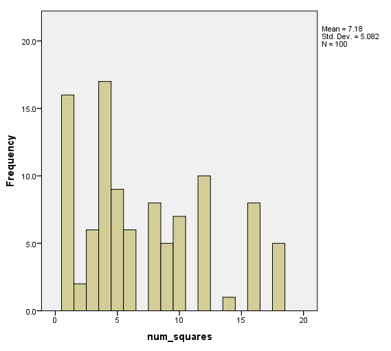

```{r, include = FALSE}
library(knitr)
```


## For grading

This assignment is worth **9 points**. The lab responses can be graded as such (with room for half pts etc.):

* 0 pts: no attempt

* 1 pt: Graph is incorrect, interpretation is slightly off, but an attempt was made.

* 2 pts: Either graph is slightly wrong or interpretation is a little off. Clear that student understands the method of creating graphs and has good thoughts on interpreting the conceptual ideas of the question, but hasn't put everything together.

* 3 pts: Great graph and great response.

### Part 7 (of the whole Lab 3 worksheet) - 3 pts

**Use SPSS to produce a histogram of the number of squares (solar panels) in each building in Weberville. The data can be found in weberville.sav on Moodle. Save your histogram and describe important and interesting features.**

{width = 50%}

The highest frequencies are buildings with less than 5 squares. The histogram is slightly skewed right, since only a handful of buildings have more than 15 squares.

### Part 8 - 3 pts

**How do the averages you calculated using Method 1 and Method 2 compare to the true mean number of solar panels on hoes in Weberville?**

Multiple answers possible. Many will have overestimated the true mean with Method 1. Most should be very close to the true mean with Method 2.

### Part 9 - 3 pts

**Consider the histograms generated from all of the Method 1 and Method 2 means in the class. What do you see in the plots? What conclusions might you be able to draw?**

Again, we should see that Method 1 is slightly biased overall. People tend to select larger buildings more often in their "representative" sample. The conclusion is that even when we try to be unbiased, often it is unavoidable unless truely random. Method 2 should provide us with better estimates as a whole class.
