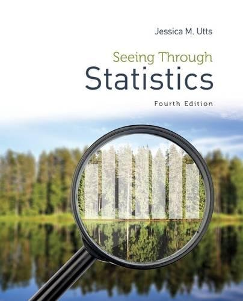

# Overview

**Professor:** Joe Roith

**Office:** 403 Regents Hall of Mathematical Sciences (RMS)

**Telephone:** (507) 786-3681

**Email:** [roith1@stolaf.edu](mailto:roith1@stolaf.edu) 

  >Note: I will respond to emails as quickly as possible during the week before 5 PM. I *may* respond to emails in the evenings or on weekends, but do not rely on it.

**Drop-in office hours:** Tue 10 - 11 AM, Wed 2 - 3 PM, Thurs 9 - 10 AM. 

You may also schedule an appointment with me (check my [calendar](https://calendar.google.com/calendar/r/week/2019/9/11?tab=mc&pli=1) for availability) or drop by and talk if my door is open.

**Class meetings:**	T 11:45 - 1:10, Th 12:45 - 2:05 in RNS 210

  * Lab Section A: F 8:00 - 8:55 in RML 115
    
  * Lab Section B: F 9:05 - 10:00 in RML 115
    
  * Lab Section A: F 10:45 - 11:40 in RML 115

**Textbook:** *Seeing Through Statistics (4th edition)*,
Jessica M. Utts

**Companion website:**	[www.cengage.com/UttsSTS4e](https://www.cengage.com/UttsSTS4e)

**Link to the "real" syllabus:** [Shadow Syllabus for *all* your classes](https://sonyahuber.com/2014/08/20/shadow-syllabus/amp/)

**Course computing:** SPSS - available on all campus computers.

# Course description

This course is an introduction to the principles of statistical thinking in the spirit of the liberal arts. Students will learn the language, practical applications, and concepts involved in statistical reasoning. Statistics is the science of learning from data. By now you are aware that vast amounts of data are collected every moment in a variety of settings like political polls, clinical trials, stock markets, and social media user metrics to name just a few. Statistical methods are necessary to extract information, create predictions, and make evidence based decisions using data.

This is not a course in mathematics. Although we use mathematics, statistics is quite different. Be prepared to *think* and *read* critically in this class. In addition, there is a language and vocabulary of statistics that is important to use properly.

# Course objectives

1. To understand how statistics assists in understanding and reasoning with the vast amounts of data produced by society.

2. To become a critical consumer of statistical data, scientific reports, and their conclusions.

3. To make decisions under uncertainty.

4. To design a data collection protocol, collect data, analyze the data to answer research questions, and summarize the conclusions using visualizations, summary statistics, and clear exposition.

5. To learn how to perform the above using the software program SPSS.

# Features of this course

## Philosophy
This course and this textbook are centered on the idea that you will better understand and retain important statistical concepts if you build your own knowledge and practice using it, rather than by memorizing and regurgitating a set of facts. In order to actively construct knowledge in statistics, you must:

* engage in the material and think carefully about it; there are rarely rote, black and white solutions in statistics.

* Attend class, participate in class, and complete pre-class preparations.

* Attend labs, develop skills using SPSS, and transfer those skills to data beyond homework and test situations.

* Expect weekly homework sets, occasional table quizzes, and longer projects which allow you to pull your knowledge together.

## Grades
Your course grade will be determined as follows:

Category        |  Weight
--------------------- | ---------
Homework Assignments |		10%
Lab Assignments and Participation | 10%
Quizzes  | 10%
Midterm Exams (2)	|		20% each
Group Project		|		10%
Final Exam			|	    20%

College wide grading benchmarks can be found at: [http://catalog.stolaf.edu/academic-regulations-procedures/grades/](http://catalog.stolaf.edu/academic-regulations-procedures/grades/)

### Homework
Shorter assignments with problems drawn from the reading will be due at the beginning of each class. Longer homework assignments will be assigned weekly and submitted along with lab assignments. Homework assignments are designed to give you practice applying new statistical concepts to new data contexts. Homework will be drawn from the exercises at the end of each chapter as well as additional questions.

* You are encouraged to discuss problems together, but each person must hand in their own work.

* If you work with other students, you must note this fact (along with the students' names) on your assignment.

* You must show your work for full credit.

* Homework is due by 5:00 PM on the due date (generally Monday). Late homework assignments will not be accepted. This includes late assignments due to technical issues. Plan ahead. The lowest homework score will be dropped.

* I expect that you will start soon after receiving the assignment. The assignments are definitely not designed to be one-night jobs.

### Lab Assignments
You will hand in a write-up after each Friday lab along with some homework problems. Most work will be completed during lab, but you may need to finish on your own. Due dates will typically be on the Monday following lab at 5:00 PM to give you time to write a careful response. The book problems and homework questions will be posted prior to lab. You are encouraged to work with others, but must submit your own work. Late lab assignments will not be accepted, but the lowest lab score will be dropped. Lab attendance is factored into your final grade.

### Table Quizzes
You will take an average of one quiz each week during class. The purpose of these quizzes is two-fold. First they provide immediate reinforcement and enhancement of important points from the reading and previous classes. Second, they provide me with a better idea of what materials you understand thoroughly, what material is proving difficult, and what material to cover in more depth during class. The format of these quizzes will vary - individual or group, self-selected or randomly-assigned groups, open book or closed book, etc. Quizzes will never be focused on new material. If you miss class, you cannot make up a quiz, but your lowest quiz score will be dropped.

### Exams
The midterm and final exams will focus on your abilities to interpret results, to express an understanding of statistical concepts, and to engage in statistical thinking on open-ended questions. They will *not* focus on plug-and-chug mathematics or hairy mathematical proofs. Make-up exams will be granted only under *very* special circumstances, and *only* if arranged in advance.

### Project
A group project will be completed by the end of the semester. These are *team*-oriented tasks that will require hypothesis generation, data analysis, critical thinking, and thoughtful presentation of statistical results. Additional information on the project, including due dates will be provided later on in the semester. 

## Computation
Computers will be used during the Friday labs. Computers mean we do not need to perform tedious calculations but will allow us to learn how statistical methods work in practice. Computing is a necessary part of the course, but certainly not the emphasis. Students who use computers during lab time for purposes beyond Stat 110 (email, internet surfing, paper writing, etc.) may have their computer privileges revoked. 

## Class Preparation and Participation
You are expected to come to class having read the assigned readings and completed assigned work. You will be asked to show work on the board, work with classmates on in-class activities, and engage in classroom assignments. Course grades may be adjusted based on class participation and attendance.

## Classroom behavior
I am happy to take any questions in class, no matter how trivial they may seem. To facilitate an open learning environment, please respect each other. Raise your hand, listen when others are talking (including me), and avoid distracting or rude behavior. Please turn off your cell phone ringers, and refrain from using your phone during class. Lecture slides or notes will be posted on Moodle. **Please do not use laptops or any other electronic devices during class.**

# Available help 

You can all be successful in this class! If you are struggling or if you’re feeling good about things but have some questions, there are several resources:

Come see me at my drop-in office hours, or make an appointment, or see if my door’s open

* Connect with your classmates.

* CIR Office Hours are 1-2 PM Mon-Fri and 7:30-8:30 PM Sun-Thurs for project questions only.

* Visit the [Academic Support Center](https://wp.stolaf.edu/academic-support/) if you want to improve your general study skills and habits.

## Supplemental Instruction
This section of Stat 110 is supported by Supplemental Instruction (SI). SI is a series of weekly review sessions for students lead by the SI Leader Leon Zhou. SI is provided for all students in the course who want to acquire effective learning strategies, develop a stronger understanding of course material, and improve their grades. In most cases, regular SI attendance results in at least one letter grade higher than if a student never attended. SI is a structured and collaborative learning environment where students can further engage with course material and enhance their learning. SI sessions will start the first week of class and end the last day of classes. Faculty support and SI are the primary resources for students enrolled in this class.

### Leon’s SI sessions

| Day | Time | Room |
| ------| ------- | ------- |
| Sundays | 3:00 - 4:00 PM | TOH |
| Tuesdays | 7:30 - 8:30 PM | TOH |
| Thursdays | 7:30 - 8:30 PM | TOH |

## Tutor Requests 
Tutors are available through the [CAAS](https://wp.stolaf.edu/caas). I will only approve a tutor request once you have taken full advantage of resources available to you in and out of class. You are encouraged to work with classmates on homework and form study groups. You are required to attend SI sessions and office hours prior to requesting a tutor. Additionally, you must discuss with me your goals for working with a tutor prior to placing a request with ASC. Absence from class will prevent you from obtaining or continuing with an assigned tutor.

# Notes and Statements

## Note about Disabilities 

I am committed to supporting the learning of all students in my class. If you have already registered with Disability and Access (DAC) and have your letter of accommodations, please meet with me as soon as possible to discuss, plan, and implement your accommodations in the course. If you have or think you have a disability (learning, sensory, physical, chronic health, mental health or attention), please contact Disability and Access staff at 507-786-3288 or by visiting [wp.stolaf.edu/academic-support/dac](wp.stolaf.edu/academic-support/dac).

## Statement of Inclusivity 

In keeping with St. Olaf College’s mission statement, this class strives to be an inclusive learning community, respecting those of differing backgrounds and beliefs. As a community, we aim to be respectful to all citizens in this class, regardless of race, ethnicity, religion, gender or sexual Orientation.

I am committed to making course content accessible to all students.  If English is not your first language and this causes you concern about the course, please speak with me.

## Note about Academic Integrity

Plagiarism, the unacknowledged appropriation of another person’s words or ideas, is a serious academic offense. It is imperative that you hand in work that is your own, and that cites or gives credit to others whenever you draw from their work. Please see St. Olaf’s statements on academic integrity and plagiarism at: [https://wp.stolaf.edu/thebook/academic/integrity/](https://wp.stolaf.edu/thebook/academic/integrity/). See also the description of St. Olaf’s honor system at: [https://wp.stolaf.edu/honorcouncil/](https://wp.stolaf.edu/honorcouncil/) 

St. Olaf's Academic Integrity Policy, including the Honor System, is an integral part of your academic experience. I consider any violation of this code to be extremely serious and will handle each case appropriately. Here are some guidelines for this class. They do not cover all eventualities so if you have any doubts about a course of action you can ask me.

* Homework assignments may be done in collaboration with other students (this is highly encouraged). However, the final product must written by you, in your own words, unless group assignments have been specifically allowed.

* In no event can you copy answers from another student, a website, solutions manuals, or elsewhere.

* When you sign your pledge on an exam that you have "neither given nor received assistance, and seen no dishonest work" I treat your signature as your solemn pledge that all your actions have been honorable. For example, if we have a take-home exam, you are assuring me that you shared no information with others, that you did not solicit or receive help from anyone besides me, etc.

* Don't treat the honor code lightly; if you're in doubt about a possible violation, ask me.

# Schedule

**Tentative Outline of topics:** The following table provides a *rough sketch* of the topics we’ll cover during specific weeks, along with the associated reading assignments in our textbook:

| Week |Topics | Book Chapter |
| -------- | ---------------------- | ------------------- |
| Day 1 | Introduction to Stats | 1 |
| Week 2 | Consuming and collecting Data | 2 & 3 |
| Week 3 | Sampling and Studies | 4, 5 & 6 |
| Week 4 | Summarizing and visualizing data, Normal distribution | 7, 8 & 9 |
| Week 5 | More visualizing and review | 9 |
|  | **Exam #1 (Tuesday, October 1)** | |
| Week 6 | Categorical Relationships | 12 |
| Week 7 | $2 \times 2$ tables | 12 & 13|
| | **FALL BREAK (October 12 - 15)** |
| Week 8 | Relationships and Correlation | 10 & 11 |
| Week 9 | Probability and Review| 14 |
| | **Exam #2 (Tuesday, November 5)** | |
| Week 10 | Samples and confidence intervals | 19, 20 & 21 |
| Week 11 | Samples and confidence intervals (cont.) | |
| Week 12 | Hypothesis testing | 22 & 23 |
| Week 13 | Hypothesis testing (cont.) | |
| | **Thanksgiving Break (November 27 - 29)** | |
| Week 14 | "Statistical Significance" and open topics | 24 |
| Week 15 | Wrap up and Review | |
| | **Final Exam: Monday, Dec 16, 2:00-4:00 PM** |

 ](images/correlation.png)